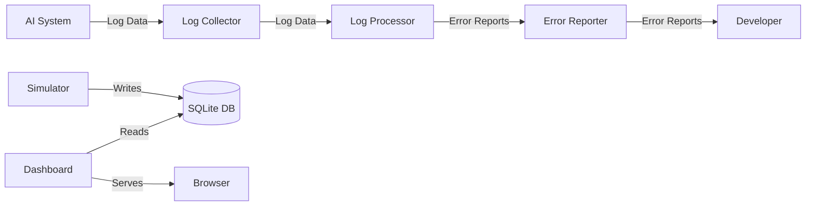

# ai-logmon

A Python library for automated logging and error reporting in AI systems.

## Problem Statement

As AI systems become more complex and widespread, the need for robust logging and error reporting mechanisms becomes increasingly important. However, current logging solutions are often manual, error-prone, and lack standardization.

## Why it Matters

Automated logging and error reporting is crucial for ensuring the reliability, scalability, and maintainability of AI systems. It enables developers to quickly identify and diagnose issues, reduce downtime, and improve overall system performance.

## Architecture



## Project Structure

```markdown
ai-logmon/
|____main.py
|____src/
|       |____log_collector.py
|       |____log_processor.py
|       |____error_reporter.py
|____dashboard/
|       |____app.py               # Flask entry point
|       |____db.py                # SQLite storage helper
|       |____simulator.py         # Demo log generator
|       |____routes.py            # API endpoints (Blueprint)
|       |____templates/
|       |       |____index.html   # Dashboard UI
|       |____static/
|               |____style.css    # Dark theme styles
|               |____dashboard.js # Client-side JS
|____requirements.txt
|____README.md
|____CONTRIBUTING.md
```

## Installation

```bash
pip install -r requirements.txt
```

## Quick Start

### Run the logging pipeline

```python
from ai_logmon.src.log_collector import LogCollector
from ai_logmon.src.log_processor import LogProcessor
from ai_logmon.src.error_reporter import ErrorReporter

log_collector = LogCollector()
log_processor = LogProcessor()
error_reporter = ErrorReporter()

log_collector.start()
log_processor.start()
error_reporter.start()
```

### Run the dashboard

```bash
python dashboard/app.py
```

Then open [http://localhost:5000](http://localhost:5000) in your browser.

The dashboard includes a built-in log simulator that generates demo data automatically, so you can see it in action immediately.

### Dashboard Features

- **Real-time stats** — Total logs, errors, warnings, and info counts with animated counters
- **Log Level Distribution** — Doughnut chart showing the breakdown of log levels
- **Error Trend** — Line chart tracking new errors over time
- **Live Log Feed** — Auto-refreshing table of recent log entries with level badges
- **Error Panel** — List of recent errors with severity tags
- **Dark Theme** — Glassmorphism design with responsive layout

## Configuration

The library provides a range of configuration options to customize logging and error reporting behavior. These options can be specified in the `config.json` file.

## Design Decisions

The library is designed to be modular, flexible, and scalable. It uses a microservices architecture to separate logging, processing, and reporting components, allowing for easier maintenance and upgrade.

## Roadmap

* Implement additional logging and error reporting features
* Integrate with popular AI frameworks and platforms
* ~~Develop a web-based dashboard for monitoring and analysis~~ ✅ Done!

## Contribution

Contributions are welcome! Please see the [CONTRIBUTING.md](CONTRIBUTING.md) file for guidelines.

## License

MIT License